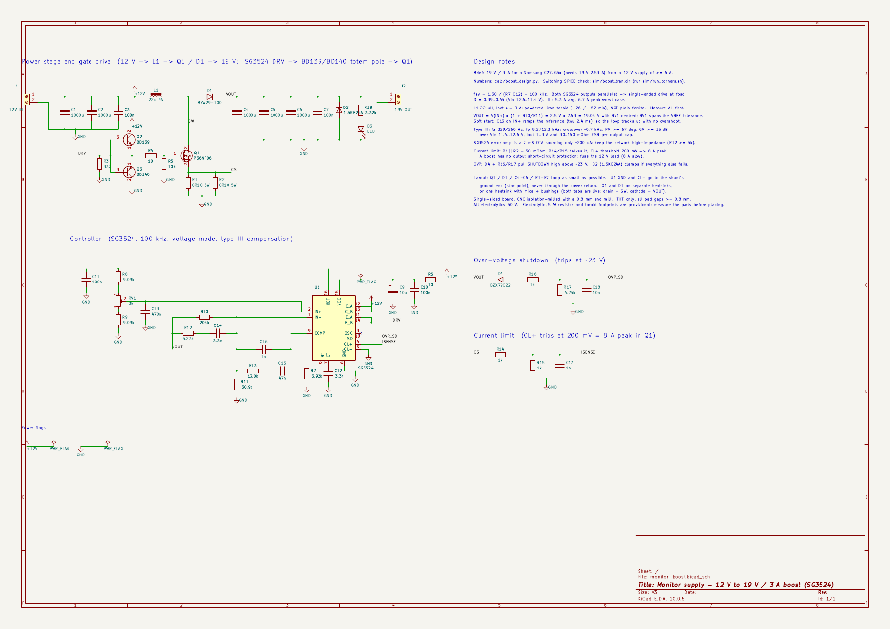
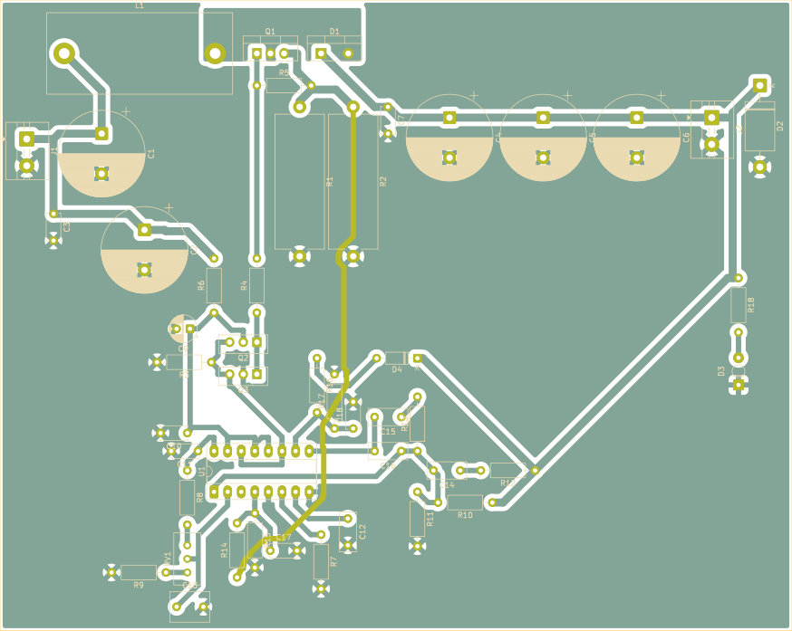

# Monitor 19 V boost: 12 V → 19 V / 3 A for the Samsung C27JG5x

The C27JG5x runs from a 19 V / 2.53 A (48 W) adapter. On a 12 V supply it browns
out and shows artifacts. This board boosts a mains-powered 12 V supply to a
regulated 19 V. The 230 V side stays inside a certified 12 V supply. Everything
built here runs at 25 V or less.

Almost every part comes from the DTU component shop. Only the inductor wire, a
fuse, the barrel-plug lead and the 12 V supply come from elsewhere. The board is
single-sided and through-hole, isolation-milled on the CNC with a 0.8 mm end
mill.

| File | What it is |
|---|---|
| `calc/boost_design.py` → `boost_design.out` | all the design arithmetic: operating point, stresses, losses, divider, loop gain |
| `sim/boost_tran.cir` | ngspice switching transient of the whole circuit (behavioural SG3524) |
| `sim/run_corners.sh` → `corners.txt` | the same at Vin 11.4 / 12.0 / 12.6 V |
| `sim/boost_tran.png`, `sim/plot.py` | soft start, 1→3→1 A load steps |
| `kicad/monitor-boost.kicad_sch` / `.pdf` / `.png` | schematic (KiCad 10) |
| `kicad/tools/boost_layout.py` | the script that draws the schematic. Edit this, not the `.kicad_sch` |
| `kicad/lib/boost.kicad_sym` | SG3524 symbol (KiCad ships none) |
| `kicad/lib/energy_system.pretty` | mill footprints: narrowed TO-220/TO-126, 3 mm LED, toroid |
| `kicad/monitor-boost-bom.csv` | BOM with the exact shop CSV entry for every part |
| `kicad/monitor-boost.kicad_pcb`, `monitor-boost-pcb.png` | the routed single-sided board |
| `kicad/monitor-boost.kicad_dru` | the one DRC exception (pad-to-pad inside Q1..Q3, 0.84 mm) |
| `kicad/production/` | Gerbers + Excellon for the mill, silkscreen DXF for the laser |
| `kicad/tools/pcb_place.py` | builds and places the board (every part hand-placed, locked) |
| `kicad/tools/pcb_finish.py` | closes the links FreeRouting leaves, refills the pours |
| `kicad/tools/export_production.sh` | regenerates `production/` |
| `kicad/tools/kpy.py` | runs a script with pcbnew patched for Python 3.14 |

**Status:** schematic done and verified (netlist matches the target topology,
readability score PASS, ERC 0 errors, 2 benign `lib_symbol_mismatch` warnings),
simulated at three input corners, **board routed**: 88/88 connections, 0 vias,
0 clearance violations at the mill's 0.85 mm, one wire link. Footprints for the
electrolytics, 5 W shunts and the toroid are still the provisional ones -- check
them against the real parts before milling (see "Before milling").





## Why a boost and not a flyback

The shop cannot build an off-line flyback. Its highest-voltage MOSFET is
200 V (IRF640), and a flyback needs 600 V or more. It stocks no UC384x, TL431
or PC817, no bobbin and no magnet wire. A homemade single-sided board carrying
325 V DC would also be the riskiest item on the bench. A boost from a certified
12 V brick keeps every volt on this board below 25 V.

## Numbers

| | Vin 11.4 V | 12.0 V | 12.6 V |
|---|---|---|---|
| duty cycle | 0.45 | 0.42 | 0.39 |
| input / inductor current (3 A out) | 5.6 A | 5.3 A | 5.0 A |
| inductor peak | 6.7 A | 6.4 A | 6.1 A |
| **simulated** VOUT at 3 A | 19.08 V | 19.08 V | 19.08 V |
| **simulated** dip on a 1→3 A step | 18.26 V | 18.27 V | 18.29 V |
| **simulated** efficiency at 3 A | 91.4 % | 91.9 % | 92.3 % |

- **fsw 100 kHz.** R7 3.92 k, C12 3.3 nF, f = 1.30 / (RT·CT). Both SG3524
  outputs are paralleled, so the switch runs at the oscillator frequency with a
  maximum duty of about 90%.
- **L1 22 µH, Isat ≥ 9 A.** That stores 0.84 mJ at saturation. A powdered-iron
  core can hold that; an ungapped ferrite toroid cannot. See the inductor section.
- **Q1 STP36NF06** (60 V, 40 mΩ): Vds is 20 V plus ringing, and it dissipates
  about 1.1 W. It needs a small heatsink.
- **D1 BYW29-100** (8 A, 100 V ultrafast): it dissipates 2.6 W. **Heatsink
  required.** The shop has no power Schottky, so this diode is the biggest loss
  on the board.
- **Output:** 3 × 1000 µF / 50 V carry 2.7 A of ripple current in total. The
  simulated ripple is about 120 mV (0.6%).
- **VOUT** = 2.5 V × (1 + 205k/30.9k) = 19.06 V with RV1 centred. RV1 covers the
  SG3524's reference tolerance (4.6–5.4 V): with the reference at either limit,
  19 V is still reachable.
- **Soft start:** C13 sits on IN+, so the *reference* ramps up (τ 2.4 ms) and the
  loop tracks it. The simulation shows no overshoot (peak 19.03 V). My first
  version clamped COMP through a diode instead; it overshot 1 V because the
  error amp winds up.
- **Compensation:** voltage mode, type III around the SG3524's own error amp.
  Zeros are at 229 and 260 Hz (under the LC double pole at about 365 Hz); poles
  are at 9.2 kHz and 12 kHz. Crossover is about 0.7 kHz. Phase margin is at least
  67° and gain margin at least 15 dB across Vin 11.4–12.6 V, 1–3 A, and 30–150 mΩ
  ESR per output cap.
- **The SG3524 error amp is a 2 mS transconductance stage that sources only
  about 200 µA** (TI SLVS077). An output disturbance reaches IN− through R12, so
  the amp stays linear up to 200 µA × R12 ≈ 1 V. My first network used half
  these impedances and the simulated load step dipped 1.1 V; doubling them
  brought that to 0.8 V. Keep the network high-impedance.
- **Current limit:** R1‖R2 = 50 mΩ, R14/R15 halve the sense voltage, and CL+
  trips at 200 mV, which is 8 A peak. This protects Q1 only. **A boost cannot
  limit an output short** (the path runs 12 V → L1 → D1 → load), so fuse the
  12 V lead at 8 A slow-blow.
- **Over-voltage:** above about 23 V, D4 (BZX79C22) plus R16/R17 pull SHUTDOWN
  high. D2 (1.5KE24A) is the last clamp. The monitor never sees a runaway output
  even if the feedback divider opens.

What the simulation does **not** cover: SG3524 propagation delays, inductor
saturation, core loss, PCB parasitics and the error amp's 1.8 V common-mode
floor (IN+ passes below it briefly during soft start). Edge speeds and ringing
come from the bench, not from this model.

## The inductor

1. **Measure the core first.** Wind exactly 10 turns of any wire on the shop
   toroid and measure L with the AD3's impedance analyzer at 100 kHz. Then
   AL = L / 100 (nH per turn²).
   - AL of roughly 30–100 nH/N² means powdered iron: good.
   - AL above about 300 nH/N² means ungapped ferrite: **it will saturate at a few
     amps, so don't use it.** Try the other shop toroid, or buy a T106-26 or
     T130-26 (yellow/white).
2. **Turns** N = √(22000 / AL): 15 turns at AL 93, 19 turns at AL 60, 26 turns at
   AL 33.
3. **Wire:** 5.6 A RMS needs about 1.1 mm² of copper. Skin depth at 100 kHz is
   0.21 mm, so use 3 strands of 0.71 mm (or 2 × 0.9 mm) in parallel rather than
   one thick wire.
4. **Saturation test before it goes on the board:** 12 V from the bench supply
   with a big cap, the inductor, a logic-level IRL530 from the shop and a 0.1 Ω
   shunt. Drive the gate with a single 18 µs pulse from the AD3 wavegen (5 V is
   enough for the IRL530). The current should ramp in a straight line to about
   10 A. If it bends upward before 9 A, the core is saturating: add turns (L goes
   up as N², Isat drops only as 1/N), or use a bigger core.

## The board

148 x 118 mm, single-sided, through-hole, isolation-milled with the 0.8 mm end
mill (fits the 203 x 152 mm envelope). Every part is hand-placed and locked;
FreeRouting (`place_route.py`, planes-kept rung) routes everything except three
links, which `pcb_finish.py` closes.

**Ground is what drives the layout.** On a TO-220 the gate pin sits next to the
drain, so the gate line starts *inside* the input current loop (C_in -> L1 -> Q1
-> shunt -> GND -> C_in) and on one layer it has to cross that loop's ground
return somewhere. So:

- The input-loop return is a protected copper strip (a no-track keep-out, pour
  allowed) from C2's minus pad to the bottom of the shunts. Nothing crosses it
  in copper; **R4 (gate) and R6 (+12V -> VCC_F) straddle it** -- their bodies
  bridge it on the component side, their pads sit either side.
- The output loop's ground (C4..C6 minus -> shunt) is fenced off the same way,
  so VOUT sense goes round the outside to the feedback network.
- The switch node is a copper pour above the L1/Q1/D1 pad row, reaching into
  Q1's middle (drain) pad.
- Everything below the strip is the control section; its ground joins the power
  ground at the strip.

Two schematic changes came out of this and are in the sheet: R5 is gate-to-source
(it was gate-to-GND), and Q2 plus the SG3524 output collectors run from VCC_F
after R6 rather than raw +12 V (C9 supplies the gate-charge pulses).

**One wire link: CS, from R2's top pad to R14's bottom pad.** It is forced: CS
starts at the shunt inside the power section and CL+ is on U1's bottom row, walled
off by the gate-drive and VCC_F runs; both ends of U1 are taken (reference
divider, feedback network) and the space between U1's pin rows already carries
two tracks (the E_A/E_B join and IN-). CS is a 50 mOhm node, so a wire picks up
little and R14/C17 filter it at the pin. In the files it is an F.Cu track
(58 short segments, drawn clear of every pad); on the bench it is one insulated
wire, laid round the parts, soldered to those two pads.

**Rules:** track 1.0 mm (Default) / 1.5 mm (Power: +12V, GND, SW, VOUT, CS),
clearance 0.85 mm. The only DRC exception (`monitor-boost.kicad_dru`) is pad to
pad inside Q1..Q3 at 0.84 mm -- still wider than the tool. **Q2/Q3 use a TO-126
footprint with 2.54 mm pitch**: the stock 2.28 mm pitch leaves 0.58 mm between
pads, which the end mill cannot cut, so bend the BD139/BD140 legs out slightly.
DRC leaves only silkscreen overlaps (cosmetic, laser) and two single-spoke
thermals on signal ground pads (U1 pin 5, Q3 collector).

**Current capacity:** the power paths are pours or 1.5 mm tracks; the hot loop
(Q1 -> D1 -> C4..C6 -> ground -> shunt) is almost entirely pour.

### Before milling

- Measure the real diameter and lead pitch of the 1000 uF / 50 V caps and the
  0R10 5 W resistors, and the wound toroid. The footprints are placeholders
  (`CP_Radial_D16.0mm_P7.50mm`, `R_Axial_Power_L25.0mm_W9.0mm_P27.94mm`, the
  energy-system toroid). If one changes, edit `kicad/tools/pcb_place.py`, then
  place -> route -> finish -> export again:

  ```
  python3 kicad/tools/boost_layout.py
  python3 kicad/tools/pcb_place.py
  python3 kicad/tools/kpy.py ~/.claude/skills/kicad-place/scripts/place_route.py route kicad/monitor-boost.kicad_pcb --out /tmp/route
  python3 kicad/tools/kpy.py kicad/tools/pcb_finish.py /tmp/route/run1/Piso/monitor-boost.routed.kicad_pcb
  sh kicad/tools/export_production.sh
  ```
- Check the shop's trimmer against the 3296W pinout.
- Heatsinks: Q1 and D1 tabs are live (drain = SW, cathode = VOUT). Separate
  heatsinks, or one with the shop's mica pads and bushings.

**Tooling notes for this machine:** FreeRouting 1.9.0 never finishes if the board
already holds any pre-routed track (fixed or protected) -- that is why SW is a pour
and the leftovers are closed afterwards. `pcbnew.SaveBoard` rewrites the sibling
`.kicad_pro` with 0.2 mm defaults, silently disarming DRC; the scripts put the real
one back. Arch's pcbnew on Python 3.14 needs `kpy.py` (a missing SWIG iterator
alias), and `board.Remove()` segfaults it.

## Bring-up

1. **No U1, no L1:** power at 12 V from the bench supply limited to 0.2 A.
   Check +12V, and check VCC_F and all pins of the empty DIP socket against GND.
2. **U1 in, L1 still out:** check REF = 5 V, a 1–3.5 V sawtooth at CT (pin 7)
   at 100 kHz, and gate pulses on Q1. Set RV1 to mid-travel before powering up.
3. **L1 in, no load**, bench limit 1 A: VOUT should come up to about 19 V.
   Trim RV1 to 19.0 V.
4. **OVP test, monitor disconnected:** lift one end of R10 (the loop loses
   feedback and runs away). The output must stop at about 23 V and the TVS must
   stay cold. Refit R10.
5. **Load:** 4 × 100 Ω / 5 W in parallel (25 Ω, 0.76 A) first. Then use an
   electronic load, or the monitor itself, up to 2.5–3 A. Watch VOUT on the
   scope while switching the load: it should dip and recover in about 1 ms with
   no ringing afterwards. Optional: measure the loop with the AD3's network
   analyzer by injecting across a 10 Ω resistor between VOUT and R10/R12.
6. **Thermal:** run 30 min at full load. D1 and Q1 tabs should stay below about
   90 °C.
7. **Inrush:** plug the 12 V in with the supply off, then switch it on. At the
   instant of connection the output caps charge straight through L1 and D1. With
   a stiff source the simulation shows a 70 A spike; a real supply's current
   limit tames it. Don't hot-plug the board onto a live supply.

Sources: [TI SG3524 datasheet (SLVS077)](https://www.ti.com/lit/ds/symlink/sg3524.pdf).
The monitor's 19 V / 2.53 A rating comes from replacement-adapter listings for
the C27JG50, so check the label on your unit.
