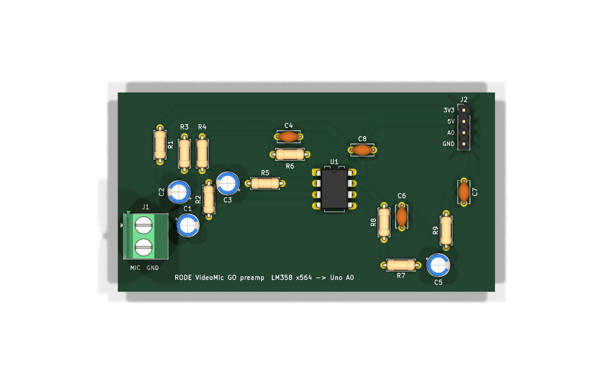

# RØDE VideoMic GO preamp board

A milled PCB for the mic preamp in the RØDE voice satellite (`~/Projects/rode-voice`). It
replaces the breadboard. The VideoMic GO runs on plug-in power from the Uno's 3V3, an LM358
amplifies by ×564 (55 dB) in two AC-coupled stages, and the output goes to the Uno's A0 through
an RC filter.

- Single-sided, 85 x 45 mm. All copper is on the bottom (B.Cu) and the parts go on top.
- CNC rule: 1.0 mm track, 0.85 mm clearance, for the 0.8 mm flat end mill. The 2.54 mm header's
  own pads are 0.84 mm apart, which `rode-preamp.kicad_dru` allows for J2 only.
- Checks run on this board:
  - Schematic: `sch_score` passes all 13 checks, ERC has 0 errors (3 `lib_symbol_mismatch`
    warnings on the LM358, which are harmless), and the netlist was read back and checked node
    by node.
  - Board: 13/13 nets connected, 0 vias, 0 wire bridges, and the GND pour is one piece. DRC
    shows 0 violations and 0 unconnected items, with 0 schematic parity issues.
- ngspice, LM358 as a 1 MHz single-pole model: bias 1.80 V on every stage, 55 dB at 1 kHz,
  −3 dB at 16 Hz and 4.4 kHz. The top corner sits below the 7 kHz you'd expect from the
  220p/470p caps because the LM358's bandwidth at ×100 adds a third pole. That is still plenty
  for speech.

## Connectors

| | Pin | Signal |
|---|---|---|
| J1 (screw terminal, left edge) | 1 | MIC: tip and ring of the mic cable, twisted together |
| | 2 | GND: sleeve |
| J2 (header, top right) | 1 | Uno 3V3 |
| | 2 | Uno 5V |
| | 3 | Uno A0 |
| | 4 | Uno GND |

J2's order is 3V3, 5V, A0, GND on purpose. 5V and A0 leave neighbouring LM358 pins (8 and 7),
so they sit next to each other on the header too and GND stays outside them. That is what lets
the board route on one layer with no wire bridges. The pins are labelled on the silkscreen.

## Bill of materials

`rode-preamp_bom.csv` is in the format that Parts Bin's Projects → Import BOM reads.

| Ref | Part | From |
|---|---|---|
| R1 | 2.2 k | home |
| R2, R3, R6 | 100 k | shop `100K` |
| R4 | 56.2 k | shop `56K2` |
| R5, R9 | 1.01 k | home |
| R7 | 10 k | home |
| R8 | 46.4 k | home |
| C1, C2, C3, C5 | 10 µF 50 V electrolytic | home. Bend the leads from 2.0 to 2.5 mm; + is marked on the silk |
| C4 | 220 pF ceramic | shop `220p` |
| C6 | 470 pF ceramic | shop `470p` |
| C7 | 10 nF ceramic | shop `10n` |
| C8 | 100 nF ceramic | shop `100n` |
| U1 | LM358 | home, in a shop `DIP8 Socket` |
| J1 | 2-pole screw terminal, 5 mm | shop `2 pol skrueterminal` |
| J2 | 4-pin male header, 2.54 mm | shop `4-Pin Male` (Molex KK pins fit the 1.0 mm holes) |

R5, R8 and R9 are the values already in the drawer: 1.01 k, 46.4 k and 1.01 k instead of
1 k, 47 k and 1 k. That gives gains of ×100 and ×5.6, bias 1.80 V and an RC corner of 16 kHz.

## Making it

- **Mill:** `production/gerbers/` holds `B_Cu`, `Edge_Cuts` and the Excellon `.drl`. Isolate B.Cu
  with an 0.8 mm tool and let the CAM do the mirroring, so don't pre-mirror. The holes are
  0.8 mm (42), 1.0 mm (4, J2) and 1.3 mm (2, J1).
- **Laser silkscreen:** `production/rode-preamp_silk_top.dxf`, top side, not mirrored.
- `rode-preamp_bottom_cu.dxf` is the copper outline. It's useful as a visual check and isn't
  the mill's input.

## Files

| File | What |
|---|---|
| `rode-preamp.kicad_sch` | Schematic, the source of truth. `draw_schematic.py` regenerates it (close KiCad first) |
| `rode-preamp.kicad_pcb` | Placed and routed board |
| `rode-preamp.place.json` | The hand placement, as footprint anchor x, y and rotation |
| `production/` | Gerbers, drill file, silk DXF, schematic PDF, renders |

The placement was done by hand because the block placer's layouts left 4–7 nets unrouted. The
rails run along the top edge with 3V3 on the outer track, the LM358 stands upright with stage A
on its left and stage B on its right, and OUT_A runs under the package between the pin rows.
FreeRouting routed that placement single-sided in one pass.
